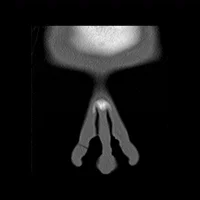
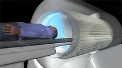

## Project Title:

### Relative location of CT slices on axial axis (Dataset)

---

## Stack
[](https://www.python.org/downloads/release/python-360/)
[](https://www.jupyter.org)
[](https://www.jetbrains.com/pycharm/)
[](https://pytorch.org/)
[](https://scikit-learn.org/)
[](http://git-scm.com/)
[](https://saythanks.io/to/kennethreitz)

## Overview

The dataset comprises 386 features (including ID and target feature, radial axis location) extracted from CT images.

The class variable is of the numeric kind, and denotes the relative location of the CT slice on the axial axis of the human body. The data was retrieved from a set of 53500 CT images from 74 different patients (43 male, 31 female).

Each CT slice is described by two histograms in polar space. The first histogram describes the location of bone structures in the image, the second the location of air inclusions inside of the body. Both histograms are concatenated to form the final feature vector. Bins that are outside of the image are marked with a value of `-0.25`.

The class variable (i.e. relative location of an image on the axial axis) was constructed by manually annotating up to 10 different distinct landmarks in each CT Volume with known location. The location of slices in between landmarks was interpolated.

## Demo




## Features and Attribute Information

- Feature `1` (patientId): Each ID identifies a different patient
- Features `2` to `241`: Histogram describing bone structures
- Features `242` to `385`: Histogram describing air inclusions
- Feature `386` (target variable; reference): Relative location of the image on the axial axis in degrees (class value). Values are in the range [0; 180] where 0 denotes the top of the head and 180 the soles of the feet.

Link to the dataset may be obtained below.

## Training procedure
The task was modelled as a `regression` task, and two models were fit on the dataset: an `SVM`, and a neural network.

The fully-connected neural network was built via the `PyTorch` library, for the regression task described in the `Overview` above. The network was wrapped via the `Skorch` API, to render it compatible with the `Scikit Learn` API. The resulting model was trained for `20` epochs, with a learning rate of `1e-4`, and a batch size of `16`.

## Quick start
1. Navigate to the `scripts` folder:
```
$ cd scripts
```
2. Ensure compressed data file is decompressed into the `data` directory

3. Run the `main.py` file.
```
$ python3 main.py --arg_key arg_value
```
4. Arguments available include:
   ```
   - epochs
   - task ('classif' or 'regression')
   - lr (learning rate)
   - classes (None if 'regression', int if 'classif')
   - n_features (number of data features)
   - batch_size
   ```


## Performance
The performance of the `Skorch` model `(~99%)` outstripped the vanilla `Scikit Learn` model `(~86%)` via a considerable margin.

An exploratory hypothesis for why this was so might be that the network, by virtue of the `RELU` non-linearities present, was able to learn non-linear features from the dataset. 

## Appendix

Data Source:

1. Dua, D. and Graff, C. (2019). [UCI Machine Learning Repository](https://archive.ics.uci.edu/ml). Irvine, CA: University of California, School of Information and Computer Science.

## Authors

1. Author: F. Graf, H.-P. Kriegel, M. Schubert, S. Poelsterl, A. Cavallaro
Source: [Dataset](https://archive.ics.uci.edu/ml/datasets/Relative+location+of+CT+slices+on+axial+axis) - 2011

## Citation
1. [UCI Citation](https://archive.ics.uci.edu/ml/citation_policy.html)
